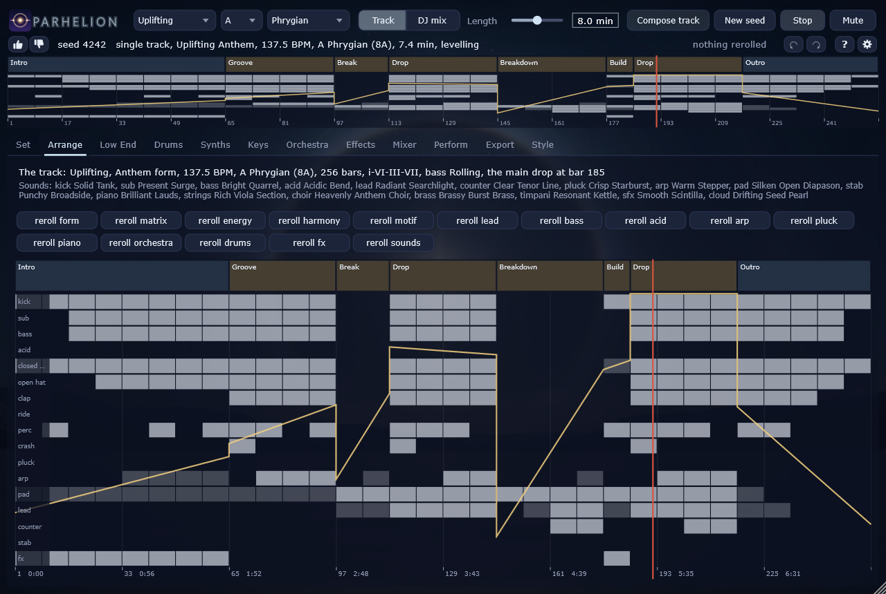

# Parhelion

A generator for trance: tracks and DJ sets composed from a seed and synthesised in real time. The sibling of [Noctuary](../AmbientSynth) (ambient), Phosphene (psytrance), Ephemeris (Berlin School) and Totality (techno).

A parhelion, a sun dog, is the bright spot of light beside the sun when it shines through ice crystals: a centre and
its detuned neighbours, which is what the JP-8000's supersaw is.



**State (01.10.2026): version 1.0.1, Phases 0 to 8** ([release notes](docs/RELEASE_NOTES.md)). The frame (copied modules with their origin in every header), the parameter
system, the score with sections, the layer matrix and the ghost kick, the deck with kick, sub, mid-bass, 303, a
twelve-lane kit, six polyphonic voices (Phosphene's JP-8000 supersaw, VA, FM and wavetable, the circuit filters, the
trance gate with its classic sixteenth masks), the pump on every bus, three rooms (room, plate, hall), the master.
Whole tracks in five styles (Uplifting, Progressive, Dream House, Acid, Deep), calibrated against 30 measured reference
tracks: a planner that writes the form and the layer matrix (the breakdown with its tease and peak, the build, the empty
beat before the drop), the harmony, the drums, the bass, the pad, the melody -- the lead's motif drawn from statistics
of royalty-free MIDI packs under the rules as hard constraints (Pachet and Roy's constrained sampling), in its versions
from the tease to the main drop, and checked bar by bar against 144250 windows of transcriptions of famous tracks so
that no known motif comes out -- the effects and the automation, and a leveler that sets the drop's loudness and the
breakdown's distance to it. A physical piano after Pianoteq's principle (the soundboard solved from plate physics,
coupled strings as complex modes, a hysteretic hammer, the strings' tension and longitudinal modes, dampers, half pedal,
the strings ringing along under the pedal) plays Dream House's motif, voiced note by note against Pianoteq's Steinway D
(Tools/pianoref: the level over the keyboard and the velocity, the brightness, the two decays, the knock, the damper). An orchestra for the Cinematic side of
Uplifting, synthesised as well: a string section of bowed modal strings (every player his own bow, stick and slip
solved in closed form, the bodies of violins to basses), a choir from the Liljencrants-Fant glottal source and
formants, brass from lips on a bore, timpani from a membrane's modes under a felt mallet. The five styles are
calibrated against the references (Tools/calibrate.py): Acid's 303 in four curves, Deep's drifting pad and granular
cloud, Progressive's rolling groove. DJ sets of any length from one seed: five dramaturgies (Warm-up, Peak, Closing,
Sunrise, Journey), harmonic mixing round the Camelot wheel, blends over DJ intros and outros with one bass swap, the
next track's hook teased on a third deck; every export with its cues in the WAV, as JSON and as a rekordbox collection,
DJ loops, MIDI and stems. Eighteen factory banks of 1024 presets each -- kick, sub, kit, bass, 303, lead, counter,
pluck, arp, pad, stab, piano, strings, choir, brass, timpani, effects, cloud -- sixteen groups of an eight by eight
grid per bank, each preset with its modulation and a measured level trim; the composer picks one per synth and track
by the style, and the choice travels with the track as a program change (the score, the MIDI file, the render's
report). Every melodic voice has a modulation block of its own: a modulation envelope, four LFOs (free or synced) and
an eight-slot matrix, fed by velocity, key, a random value, the wheel, the pressure and the score's energy, onto the
targets its model has -- the bow's pressure, speed and place, the choir's vowel and formants, the brass's breath and
blare, the hammer's and the mallet's hardness, the pitch, the level, the pan. The plugin -- VST3 and standalone, passing
pluginval at strictness 10 -- composes a single track or a DJ mix (two buttons and one length on top), has a page per
group of synths, each voice with its preset bar (the sixteen groups, the user's own presets, and the preset the composer
chose for the track that plays), its modulation block, the arrangement with its layer matrix and energy curve (the
mouse wheel zooms down to four bars, where the notes themselves show), a performer's page (mutes, master filter, echo throw, mod wheel, "Breakdown
now" and "Drop now", which rewrite the playing track from its next 8-bar line), the mixer, the export and the styles
against their references. On the Meta Quest (Quest/README.md) the whole generator runs natively and is played with the
hands, "Breakdown now" and "Drop now" as a held pinch, handed over to a second engine on a beat without a gap, under the
parhelion in the sky at the size of a room; built and signed, not yet run on a headset (none was attached).

The manual, built from the program itself (every parameter, every page):
[docs/manual/Parhelion-Manual.pdf](docs/manual/Parhelion-Manual.pdf). The plan, in German, with the reasons for
everything: [docs/PLAN.md](docs/PLAN.md). The research it rests on: [docs/research](docs/research).

## Build

```
cmake -S . -B build -G "Visual Studio 18 2026" -A x64
cmake --build build --config Release
cd build && ctest -C Release
```

The plugin is built with the rest (`PARH_BUILD_PLUGIN`, on by default; JUCE 9.0.1 from `ThirdParty/JUCE`, the sibling
Phosphene's checkout, or fetched): `build/Plugin/Parhelion_artefacts/Release/VST3/Parhelion.vst3` and
`.../Standalone/Parhelion.exe`. ctest loads the VST3 as a host does (`parh_vst3test`) and, where Tracktion's pluginval
is unpacked into `ThirdParty/pluginval`, validates it at strictness 10.

The manual: `parh_render --dump-params`, the screenshots of every page and `Tools/manual/chapters.txt` make it.

```
python Tools/manual/make_shots.py
python Tools/manual/make_manual.py
python Tools/manual/make_preview.py
```

A release -- the build with Intel's icx where oneAPI is installed (else MSVC), static runtime, the tests, pluginval,
the screenshots and the manual from that build, a checked stage, checksums, a portable zip and the setup (Inno Setup),
with `-Quest` the Meta Quest APK beside them -- lands in `Deploy/out`:

```
powershell -ExecutionPolicy Bypass -File Deploy\build_release.ps1 -Quest
```

## Render

```
build/Tools/render/Release/parh_render --seed 7 --out study.wav --midi study.mid --stems stems
build/Tools/render/Release/parh_render --seed 7 --set "compose.key=F; compose.bpm=136" --out study_f.wav
build/Tools/render/Release/parh_render --seed 7 --plan
build/Tools/render/Release/parh_render --seed 7 --style "Dream House" --out dream.wav --midi dream.mid
build/Tools/render/Release/parh_render --seed 7 --reroll motif --out other_motif.wav
build/Tools/render/Release/parh_render --seed 7 --reroll section5 --reroll arp --save-set curated.parhset --out curated.wav
build/Tools/render/Release/parh_render --study --out study.wav
build/Tools/render/Release/parh_render --seed 7 --dj 120 --set "set.dramaturgy=Sunrise; set.journey=Wander" --out set.wav
build/Tools/render/Release/parh_render --seed 7 --out track.wav --loops loops --plan-json track.json
python Tools/eval_report.py --plan track.json --wav track.wav --out docs/eval/report.md
python Tools/calibrate.py --seeds 1,2,3 --jobs 8
```

```
build/Tools/pianoprobe/Release/parh_pianoprobe --info
build/Tools/pianoprobe/Release/parh_pianoprobe --measure
build/Tools/pianoprobe/Release/parh_pianoprobe --notes "36:0.8:3,60:0.5:2" --pedal 1 --out notes.wav
```

```
build/Tools/orchprobe/Release/parh_orchprobe --measure
build/Tools/orchprobe/Release/parh_orchprobe --others
build/Tools/orchprobe/Release/parh_orchprobe --demo orchestra.wav
```

`parh_orchprobe` measures the orchestra (pitch, the bowed string's spectrum, the LF source, the brass's brightness,
the timpani's modes, the cost) and renders a short demo of all four. `parh_pianoprobe` shows the piano's design (the board's modes, every register's strings), measures what phase 4a asks
for (inharmonicity, the two-stage decay, the brightness over the velocity, the pitch glide, the cost) and renders single
notes; `--notes` with the list of `Tools/pianoref/notes_mid.py --list` plays the notes a reference piano is rendered with
(`compare.py` measures both note by note, `fit.py` fits the design's voicing to them). `parh_render` prints the plan (sections and the layer matrix), the loudness of the whole and of every section, and the
distance between the breakdown's and the drop's loudest three seconds (the research document's 4 to 8 LU). The WAV
carries a cue marker at every section; `--stems dir` writes a WAV per part, their sum the mix before the master;
`--list` prints every parameter, `--set "key=value; ..."` changes them.

## Licence

AGPL-3.0, like the siblings (see LICENSE).
