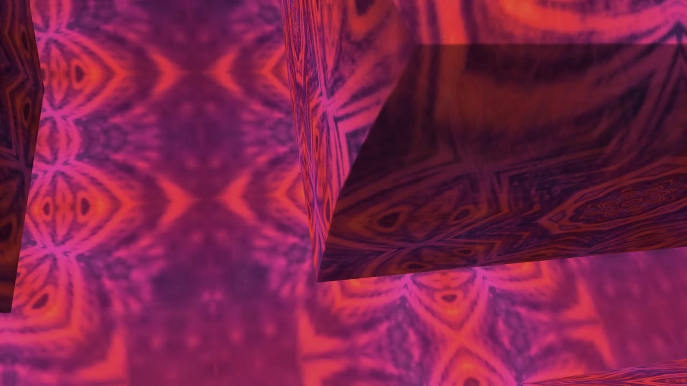
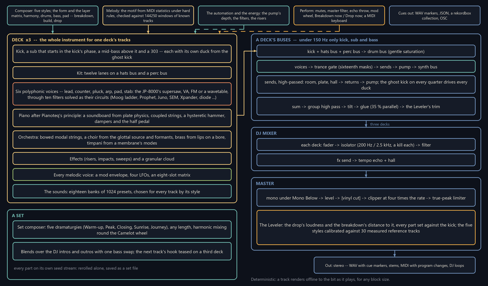
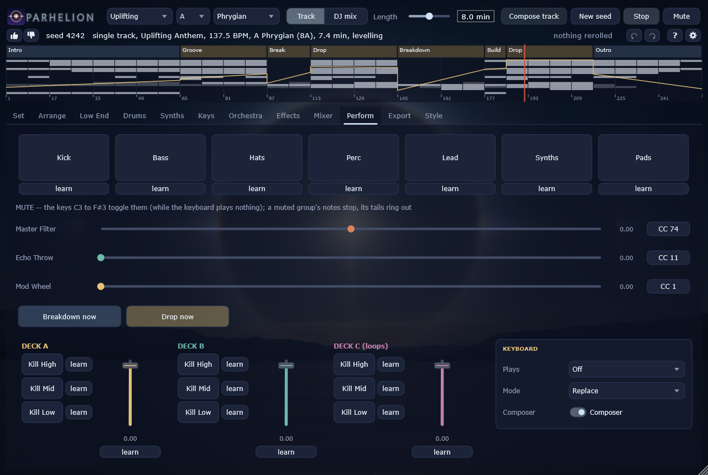
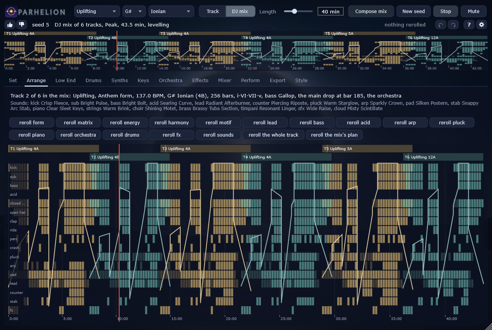
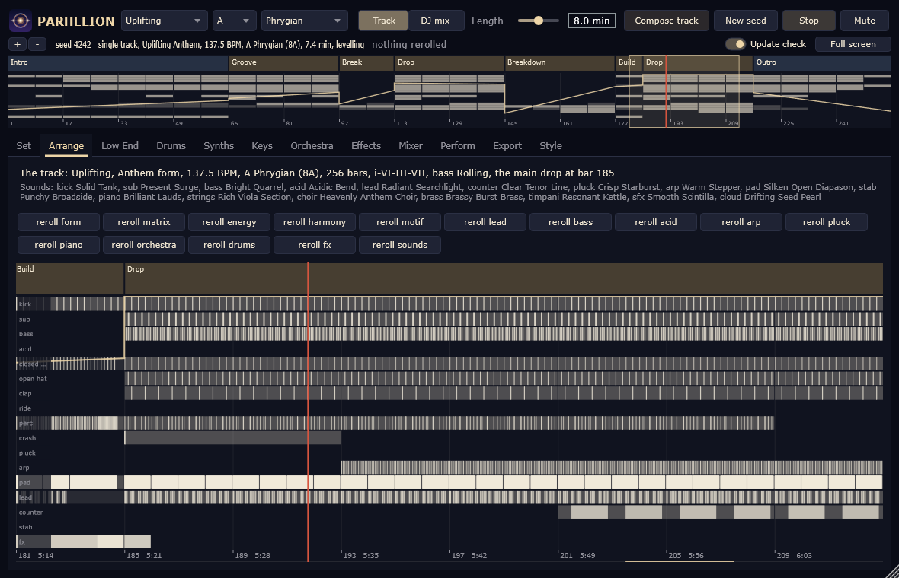
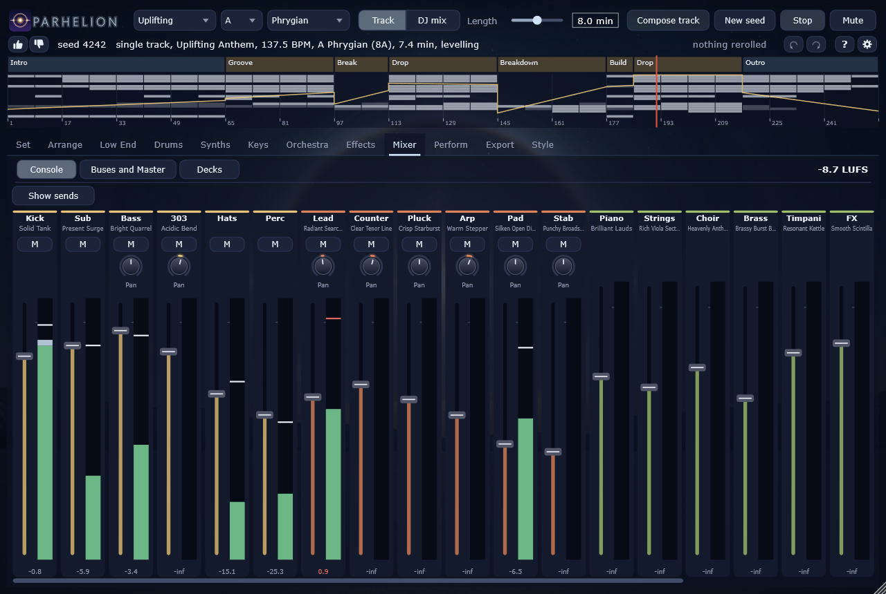

# Parhelion

A generator of trance: whole tracks and DJ sets, composed from a seed and synthesised while they play -- the
breakdown with its tease, the build, the empty beat before the drop; a lead motif of its own that is checked against
the tracks everyone knows; the JP-8000's supersaw, a physical piano and a synthesised orchestra; and the pump of the
ghost kick on every bus. Everything is synthesised; nothing is played back from a recording.

**VST3 plugin and standalone application** for Windows (x64), macOS (Apple Silicon) and Linux (x86-64), a command-line renderer, and a native app for **Meta
Quest**. Licence: AGPL-3.0.

<br clear="left" />

A parhelion, a sun dog, is the bright spot of light beside the sun when it shines through ice crystals: a centre and
its detuned neighbours, which is what the supersaw is.


## Download

**[Parhelion-1.2.0-Setup.exe](https://github.com/reneweller-coding/Parhelion/releases/download/v1.2.0/Parhelion-1.2.0-Setup.exe)**
installs the standalone, the VST3, the offline renderer and the manual. Nothing else has to be installed: the runtime
is linked in. There is a
**[portable zip](https://github.com/reneweller-coding/Parhelion/releases/download/v1.2.0/Parhelion-1.2.0-portable.zip)**
for anyone who would rather not run an installer, the
**[Quest app](https://github.com/reneweller-coding/Parhelion/releases/download/v1.2.0/ParhelionQuest-1.2.0.apk)**
(installed with `adb install -r`, developer mode; not yet run on a headset), and the
**[manual](https://github.com/reneweller-coding/Parhelion/releases/download/v1.2.0/Parhelion-Manual.pdf)** -- every
page of the panel as a picture and what each control does.

**[macOS zip](https://github.com/reneweller-coding/Parhelion/releases/download/v1.2.0/Parhelion-1.2.0-macOS.zip)** for Apple Silicon (macOS 12 or newer): the standalone and
the VST3, built on GitHub's runners and attached to the release within the hour after it; signed ad hoc,
not notarized (README-macOS.txt inside says how to open it), and not yet tried on a real Mac.

**[Linux archive](https://github.com/reneweller-coding/Parhelion/releases/download/v1.2.0/Parhelion-1.2.0-linux-x86_64.tar.gz)** for x86-64 (glibc 2.35 or newer: Ubuntu 22.04, Debian 12,
Fedora 36 and later): the standalone, the VST3 and the renderer, built and tested on GitHub's Ubuntu runners
and tried under WSL; README-Linux.txt inside says where everything goes.

Requirements: Windows 10 or 11, a 64-bit processor with AVX2 (every x86-64 since 2013), and a VST3 host if you want
the plugin; Meta Quest 2 or later for the app. The installer is not code-signed: Windows' SmartScreen may warn once.

## Demos

[](https://github.com/reneweller-coding/Parhelion/releases/download/demos/uplifting.mp4)

A track per style, rendered by `parh_render` and nothing else: [Uplifting](https://github.com/reneweller-coding/Parhelion/releases/download/demos/uplifting.mp3), [Progressive](https://github.com/reneweller-coding/Parhelion/releases/download/demos/progressive.mp3), [Dream House](https://github.com/reneweller-coding/Parhelion/releases/download/demos/dream.mp3), [Acid](https://github.com/reneweller-coding/Parhelion/releases/download/demos/acid.mp3), [Deep](https://github.com/reneweller-coding/Parhelion/releases/download/demos/deep.mp3) (MP3). The video is the Uplifting demo with pictures by
[KaleidoscopeEnhanced](https://github.com/reneweller-coding/KaleidoscopeEnhanced), its cuts placed by the
track's own score cues (the bars, the sections, the drops). `Tools/demo/make_demos.py` renders them all again; they live on the release
[demos](https://github.com/reneweller-coding/Parhelion/releases/tag/demos).

## How it is put together



## The composer

* **Five styles** -- Uplifting, Progressive, Dream House, Acid and Deep -- calibrated against 30 measured reference
  tracks (only their statistics are kept). A track is a seed: the same seed gives the same track, sample for sample.
* **The form and the layer matrix:** intro, groove, the breakdown with its tease and peak, the build, the empty beat
  before the drop, the main drop, the outro; then the harmony, the drums, the bass, the pad and the melody, the effects
  and the automation, and a leveler that sets the drop's loudness and the breakdown's distance to it.
* **A motif of its own.** The lead's motif is drawn from statistics of royalty-free MIDI packs under the rules as hard
  constraints (Pachet and Roy's constrained sampling), in its versions from the tease to the main drop, and checked
  bar by bar against 144250 two-bar windows of transcriptions of famous tracks, kept only as hashes, so that no known
  motif comes out.
* **Reroll any part on its own** -- the form, the harmony, the motif, a section, the energy, the drums, the bass, a
  voice, the sounds -- and keep the result as a small set file.
* **DJ sets of any length:** five dramaturgies (Warm-up, Peak, Closing, Sunrise, Journey), harmonic mixing round the
  Camelot wheel, blends over the DJ intros and outros with one bass swap, the next track's hook teased on a third deck.

## The sound

* **The low end:** a kick that owns the downbeat, a sub that starts in the kick's phase, a mid-bass above it and a 303
  in four curves; under 150 Hz nothing else plays.
* **Six polyphonic voices** -- lead, counter, pluck, arp, pad, stab -- on the JP-8000's supersaw after Szabo's
  measurement, VA, FM or a wavetable, through ten filters solved as their circuits, and the trance gate with its classic
  sixteenth masks.
* **A physical piano** after Pianoteq's principle -- the soundboard solved from plate physics, coupled strings as
  complex modes, a hysteretic hammer, dampers and the half pedal --, voiced note by note against a Steinway D.
* **An orchestra, synthesised as well:** a string section of bowed modal strings, a choir from the Liljencrants-Fant
  glottal source and formants, brass from lips on a bore, timpani from a membrane's modes under a felt mallet.
* **Modulation on every melodic voice:** a mod envelope, four LFOs (free or synced) and an eight-slot matrix, onto the
  targets its model has -- the bow's pressure, the choir's vowel, the brass's breath, the hammer's hardness.
* **Eighteen factory banks of 1024 presets** each; the composer picks one per synth and track by the style, and the
  choice travels with the track as a program change.
* **The mix:** the ghost kick on every quarter drives every duck -- the pump, the same curve on every bus --, three
  rooms (room, plate, hall), a DJ mixer with isolators, a master with a clipper at four times the rate and a true-peak
  limiter.

## Playing and export

* **In a DAW** Parhelion follows the host's transport and tempo. The **Perform** page: mutes, a master filter, an echo
  throw, the mod wheel, and "Breakdown now" and "Drop now", which rewrite the playing track from its next 8-bar line.
* **Play it yourself:** a MIDI keyboard plays a voice -- the kit, the bass, the 303, the six polyphonic voices, the
  piano, the strings, the choir, the brass, or each on its channel -- with the sound its page has; Replace leaves that
  voice's generated notes out, Layer plays over them, and with the composer off only what you play sounds.
* **Out:** a WAV with a cue marker at every section, the cues as JSON and as a rekordbox collection, DJ loops, MIDI
  with the program changes, and stems that sum to the mix.

## The pages

| | |
|---|---|
|  |  |
| Perform: mutes, the master filter, Breakdown now and Drop now, the keyboard | A DJ mix, track by track |
|  |  |
| Zoomed in to the notes themselves | The mixer: a strip per voice, the composer's mix on the faders |

The panel is the family's -- [Totality](https://github.com/reneweller-coding/Totality) (techno),
[Phosphene](https://github.com/reneweller-coding/Phosphene) (psytrance),
[Ephemeris](https://github.com/reneweller-coding/Ephemeris) (Berlin School) and, in part,
[Noctuary](https://github.com/reneweller-coding/Noctuary) (ambient): the same header, the same order of the tabs, the
same keys (Space, Ctrl+Z / Ctrl+Y, F1, F11), the same controllers (74 the master filter, 11 the echo throw, 1 the mod
wheel) and the same hands on a Meta Quest -- whose controls show only while a headset sends them. On the Quest the
whole generator runs natively and is played with the hands, "Breakdown now" and "Drop now" as a held pinch, under the
parhelion in the sky at the size of a room.

The plan, in German, with the reasons for everything: [docs/PLAN.md](docs/PLAN.md). The research it rests on:
[docs/research](docs/research). The manual is built out of the program itself
([docs/manual](docs/manual/Parhelion-Manual.pdf)).

## With a DAW and other apps

In a DAW Parhelion sends what it plays as MIDI -- every part on a channel of its own, as in the MIDI export -- and has a
stereo output per stem besides the main one, off until the host switches them on, so a part can be recorded as
notes or mixed on a channel of its own. The standalone joins an **Ableton Link** session (Settings > Ableton
Link): the session's tempo, its bars, its start and stop. A MIDI keyboard can be split between two voices,
locked to the scale and given a velocity curve (the Keyboard group). The manual has the details (With a DAW and other apps).

## Build

The same in every instrument of the family (`build.ps1`, `CMakePresets.json`, `cmake/Family.cmake`):

```powershell
.\build.ps1               # Visual Studio's compiler, Release: build\msvc (the solution), the programs in bin\msvc
.\build.ps1 icx           # Intel's oneAPI compiler: build\icx, the programs in bin\icx
.\build.ps1 msvc -Test    # and the tests (ctest)
.\build.ps1 icx -Run      # and start the standalone
.\build.ps1 quest         # the Meta Quest app: bin\quest\ParhelionQuest.apk
```

| Folder | What is in it |
|---|---|
| `bin\msvc`, `bin\icx` | what can be started: the standalone, the VST3, the renderer (and the files they read) |
| `build\<preset>` | the build trees -- `build\msvc\Parhelion.slnx` for Visual Studio |
| `dist\` | the release: setup, portable zip, checksums (`Deploy\build_release.ps1`, from `build\release`) |
| `work\` | local data, renders and logs, never in git |

Without the script: `cmake --preset msvc`, `cmake --build --preset msvc`, `ctest --preset msvc`; the icx presets need
Visual Studio's and oneAPI's environment, which `build.ps1` sets up.

The plugin is built with the rest (`PARH_BUILD_PLUGIN`, on by default; JUCE 9.0.1 from `ThirdParty/JUCE`, the sibling
Phosphene's checkout, or fetched): `bin\msvc\Parhelion.vst3` and `bin\msvc\Parhelion.exe`. ctest loads the VST3 as a
host does (`parh_vst3test`) and, where Tracktion's pluginval is unpacked into `ThirdParty/pluginval`, validates it at
strictness 10. `PARH_MUTE=1` starts the standalone or the plugin muted; every automated run uses it.

The manual: `parh_render --dump-params`, the screenshots of every page and `Tools/manual/chapters.txt` make it.

```
python Tools/manual/make_shots.py
python Tools/manual/make_manual.py
python Tools/manual/make_preview.py
python Tools/manual/make_flow.py
```

A release -- the build with Intel's icx where oneAPI is installed (else MSVC), static runtime, the tests, pluginval,
the screenshots and the manual from that build, a checked stage, checksums, a portable zip and the setup (Inno Setup),
with `-Quest` the Meta Quest APK beside them -- lands in `dist\`:

```
powershell -ExecutionPolicy Bypass -File Deploy\build_release.ps1 -Quest
```

## Render

```
bin/msvc/parh_render.exe --seed 7 --out study.wav --midi study.mid --stems stems
bin/msvc/parh_render.exe --seed 7 --set "compose.key=F; compose.bpm=136" --out study_f.wav
bin/msvc/parh_render.exe --seed 7 --plan
bin/msvc/parh_render.exe --seed 7 --style "Dream House" --out dream.wav --midi dream.mid
bin/msvc/parh_render.exe --seed 7 --reroll motif --out other_motif.wav
bin/msvc/parh_render.exe --seed 7 --reroll section5 --reroll arp --save-set curated.parhset --out curated.wav
bin/msvc/parh_render.exe --study --out study.wav
bin/msvc/parh_render.exe --seed 7 --dj 120 --set "set.dramaturgy=Sunrise; set.journey=Wander" --out set.wav
bin/msvc/parh_render.exe --seed 7 --out track.wav --loops loops --plan-json track.json
python Tools/eval_report.py --plan track.json --wav track.wav --out docs/eval/report.md
python Tools/calibrate.py --seeds 1,2,3 --jobs 8
```

```
build/Tools/pianoprobe/Release/parh_pianoprobe --info
build/Tools/pianoprobe/Release/parh_pianoprobe --measure
build/Tools/pianoprobe/Release/parh_pianoprobe --notes "36:0.8:3,60:0.5:2" --pedal 1 --out notes.wav
```

```
build/Tools/orchprobe/Release/parh_orchprobe --measure
build/Tools/orchprobe/Release/parh_orchprobe --others
build/Tools/orchprobe/Release/parh_orchprobe --demo orchestra.wav
```

`parh_orchprobe` measures the orchestra (pitch, the bowed string's spectrum, the LF source, the brass's brightness,
the timpani's modes, the cost) and renders a short demo of all four. `parh_pianoprobe` shows the piano's design (the
board's modes, every register's strings), measures what phase 4a asks for (inharmonicity, the two-stage decay, the
brightness over the velocity, the pitch glide, the cost) and renders single notes; `--notes` with the list of
`Tools/pianoref/notes_mid.py --list` plays the notes a reference piano is rendered with (`compare.py` measures both
note by note, `fit.py` fits the design's voicing to them). `parh_render` prints the plan (sections and the layer
matrix), the loudness of the whole and of every section, and the distance between the breakdown's and the drop's
loudest three seconds (the research document's 4 to 8 LU). The WAV carries a cue marker at every section;
`--stems dir` writes a WAV per part, their sum the mix before the master; `--list` prints every parameter,
`--set "key=value; ..."` changes them.

## The family

Parhelion is one of five instruments that share their build, their panel and the hands of a Meta Quest: [Noctuary](https://github.com/reneweller-coding/Noctuary) (ambient), [Phosphene](https://github.com/reneweller-coding/Phosphene) (psytrance), [Ephemeris](https://github.com/reneweller-coding/Ephemeris) (Berlin School), [Totality](https://github.com/reneweller-coding/Totality) (techno) and [Parhelion](https://github.com/reneweller-coding/Parhelion) (trance).
All five, with their demos, on one page: **[reneweller-coding.github.io/VRAudio](https://reneweller-coding.github.io/VRAudio/)**.

## Licence

AGPL-3.0, like the siblings (see LICENSE).
